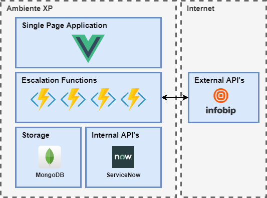

# Sistema de gestão de acionamentos

Desenvolvido por:
- Felipe Nader
- Rodolfo Leopoldino

# Arquitetura da Solução

# Front-end
SPA desenvolvido em Vue.JS e Vuetify

# Back-end
Aplicação Serverless desenvolvida em Azure Functions e MongoDB

## Fluxos Backend

### Cadastro de Funcionários
Azure Functions com triggers HTTP para operações de cadastro e busca de funcionários.

### Cadastro de Times
Azure Functions com triggers HTTP para operações de cadastro e busca de Times.

### Escalamento de Incidentes
Azure Durable Functions responsáveis por fazer o fluxo de escalonamento dos chamados e acionamento via telefone. Nesse fluxo, o status das chamadas é monitorado e novas pessoas dos times são acionadas caso as anteriores não atendam, seguindo o fluxo.

### Acompanhamento de Incidentes
Azure Functions com triggers HTTP que retornam informações úteis sobre o incidente
