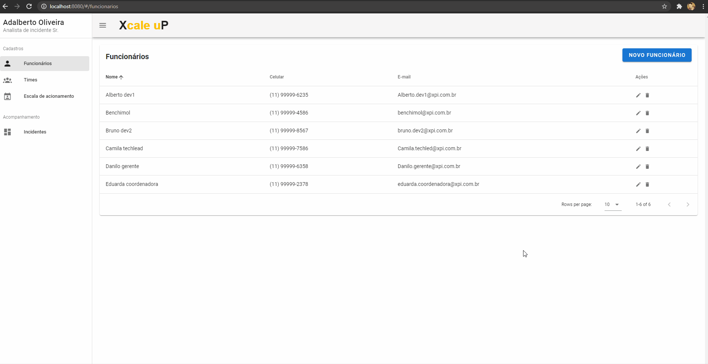

# Xcale uP - Incidents management system

Developed by:
- Felipe Nader
- Rodolfo Leopoldino

# System Preview

# Solution's architecture

# Front-end
A single page application developed using Vue.JS and Vuetify

# Back-end
Serverless application, developed using Azure Functions, Azure Durable Functions and MongoDB

## Incidents Scaling flow

## Employees CRUD
HTTP Triggers to create, edit, update and delete employees

## Teams CRUD
HTTP Triggers to create, edit, update and delete teams. On this endpoint is possible to find a team, list its members, their contact information and the next team that will be called if any of it's team members accept the call.

## Incidents Scaling
Azure Durable Functions responsible for scheduling calls and triggering via telephone. This flow also serves as the incident registration endpoint.

## Incident Tracking
Azure Functions with HTTP triggers that return useful information about the incident
