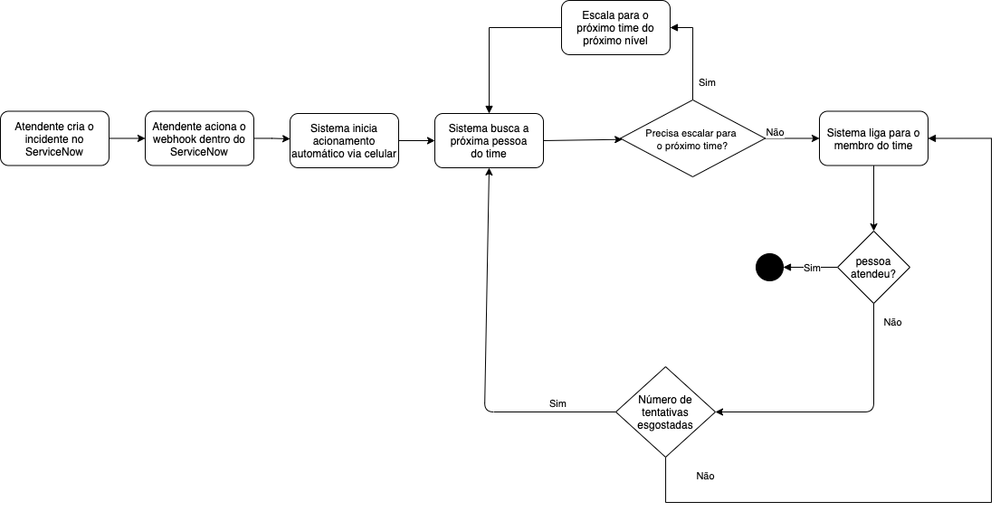

# Sistema de gestão de acionamentos

Desenvolvido por:
- Felipe Nader
- Rodolfo Leopoldino

# Prints do Sistema
TODO

# Arquitetura da Solução

# Front-end
SPA desenvolvido em Vue.JS e Vuetify

# Back-end
Aplicação Serverless desenvolvida em Azure Functions, Azure Durable Functions e MongoDB

## Fluxo de Escalonamento de incidentes

## Cadastro de Funcionários
Azure Functions com triggers HTTP para operações de cadastro e busca de funcionários.

## Cadastro de Times
Azure Functions com triggers HTTP para operações de cadastro e busca de Times. Nesse endpoint é possível cadastrar o time, a lista de membros do time, seus dados de contato e o próximo time que deve ser acionado caso nenhum dos membros desse time esteja disponível.

## Escalamento de Incidentes
Azure Durable Functions responsáveis por fazer o fluxo de escalonamento dos chamados e acionamento via telefone. Esse fluxo também funciona como o endpoint de cadastro do incidente.

## Acompanhamento de Incidentes
Azure Functions com triggers HTTP que retornam informações úteis sobre o incidente
